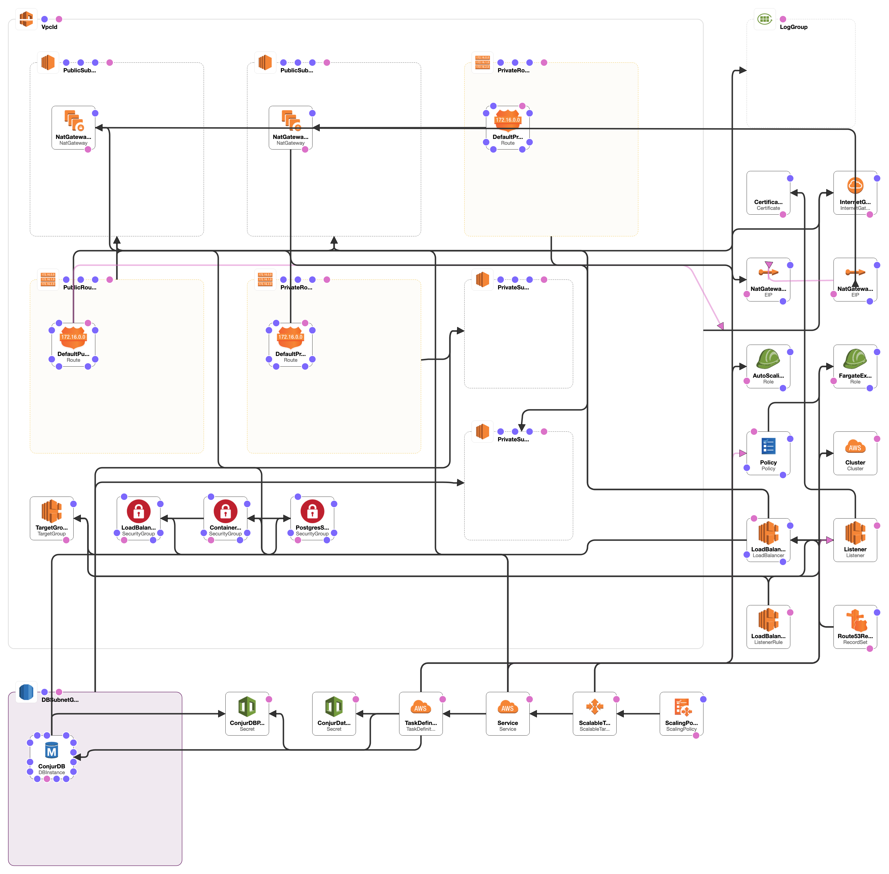

# Conjur ECS Deploy

This repo contains a cloudformation template and supporting scripts for deploying a scalable, fault tolerant and secure Conjur OSS instance in AWS.

## Architecture

Conjur Open Source is deployed in containers within ECS (Elastic Container Service). These containers are autoscaled based on CPU usage, and backed by an RDS instance. The containers are hosted on Fargate to allow scaling and reduce instance management load.

Full diagram from cloudformation designer:


## IAM Policy
The user deploying the stack must have the permissions specified in [deployer_iam_policy.yml](deployer_iam_policy.yml)

## Usage Instructions

1. Clone the repo:

    ```bash
      git clone --recursive git@github.com:cyberark/conjur-ecs-deploy
      pushd conjur-ecs-deploy
    ```

2. Generate and store the Conjur Admin password as an ASM Secret. The ARN
   of this secret is required as a template parameter.

   ```bash
   set +o history
    aws --profile myprofile secretsmanager create-secret \
      --name "ConjurAdminPassword" \
      --secret-string "file://dev/shm/secretfile"
    set -o history
    ```

3. Generate parameters file (requires jq & yq utilities)

    ```bash
      scripts/generateEmptyParams cloudformation.yml > params_mystack.yml
    ```

4. Customise the generated parameters file in your editor of choice.
5. Launch a Stack

    Stack Name pattern: `[a-z][a-z0-9]+`

    Stack Name Description: The stack name must start with a lowercase letter
    then contain lowercase letters and numbers. This is because its reused
    in various places with more restrictive character sets (eg rds db name).

    ```bash
      $ aws --profile myprofile \
      cloudformation create-stack \
        --stack-name mystack \
        --template-body file://cloudformation.yml \
        --parameters file://params_mystack.json \
        --capabilities CAPABILITY_NAMED_IAM
    ```

6. Ensure conjur is up by visiting https://your.conjur.domain

7. Configure cli

    ```bash
      docker run -it cyberark/conjur-cli:5
      conjur init -u https://your.conjur.domain
      conjur authn login -u admin
      # You will be prompted for the conjur admin password
      # you stored in ASM before running the template.
      conjur list variables
      # returns [] as a fresh instance has no variables
      # but shows that api operations are succeeding.
    ```
